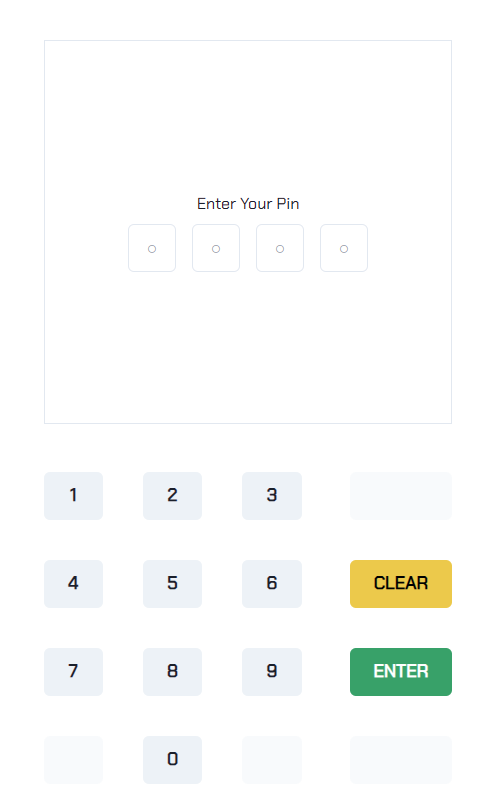
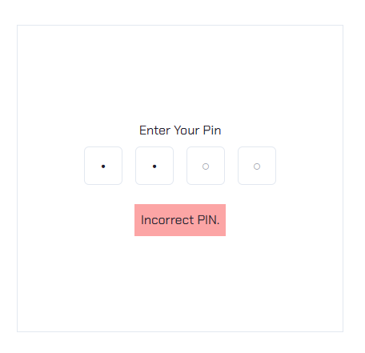
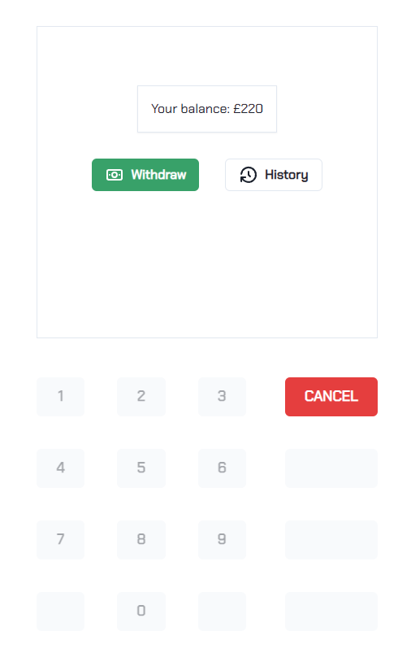
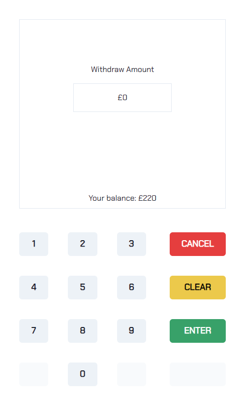
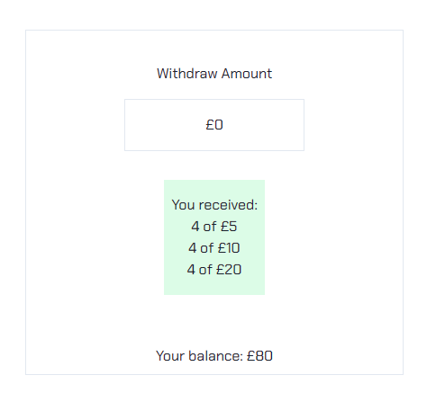
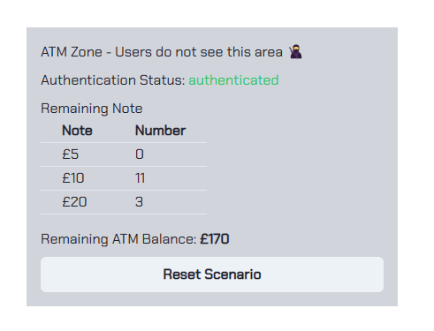
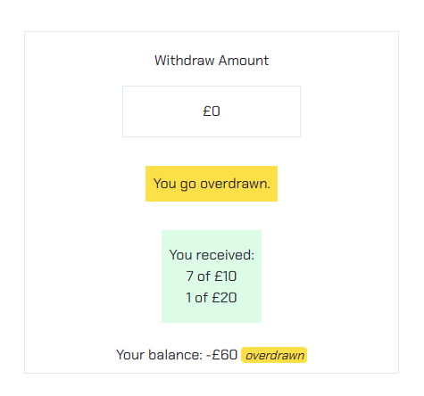
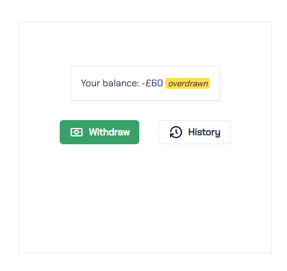
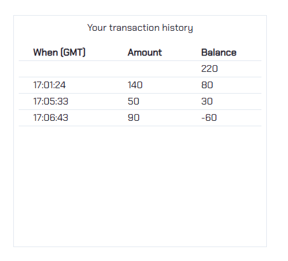

# ATM Simulator Features

Though the ATM Simulator is a simple application, it has some interesting features. Let's go through them one by one by follow the steps below.

1. Once you have opened the ATM Simulator, you will see the login screen

2. Notice that you will get an error message `Incorrect PIN.` if you enter the wrong pin like `1234` or `99`.

> You can click on `CLEAR` to clear the pin field.

> Once you have entered 4 digits, the number button will be disabled.

3. Enter the pin `1111` and click on `ENTER` to login.

You will now see the ATM page. In this page, you can

- See your current balance. In this case, it is `220`.
- Go to Withdraw page through the `Withdraw` menu.
- Go to Transaction History page through the `History` menu.
- Or logout through the `CANCEL` button.

All other buttons are disabled.

4. Click on the `Withdraw` menu to go to the Withdraw page.

In this page, all the buttons are enabled. Allowing you to perform the following actions.

- Enter the amount you want to withdraw. In this case, it is `140`.
- Click `ENTER` to withdraw.

- We can see that the balance is now `80`.
- We can see the **combination of notes** that we will get from the ATM.

If you scroll a little bit down. You will see the **ATM Zone**. Which is a visual representation of the ATM notes, ATM balance, and states.

5. You can enter the new amount to withdraw. In this case, it is `50`.

Notice that your current balance is now `30`.

6. For the last withdrawal, let's withdraw `90`.

Notice that you will get an error message `You go overdrawn.` if you enter the amount that is more than your current balance.

Your current balance is now `-60` with the overdrawn state.

At this point, you can play around with the ATM Simulator. Try to withdraw different amounts and see what happens. Here are some examples.

- Withdraw more than the ATM remaining balance.
- Withdraw more than your current balance plus your overdrawn limit (£100).

7. Let's go back to the previous screen by clicking `CANCEL`

You will see that your current balance is now `-60` with the overdrawn state.

8. Now let's go to the `History` page. To see what we have performed so far.

You should see your last 3 transactions. Which contains the amount, the time, and your current balance.

9. You can go back to the ATM page by clicking `CANCEL` and logout with the `CANCEL` button. Alternatively, you can scroll to the ATM Zone where you will find the `Reset Scenario` button to reset everything and start over again.
